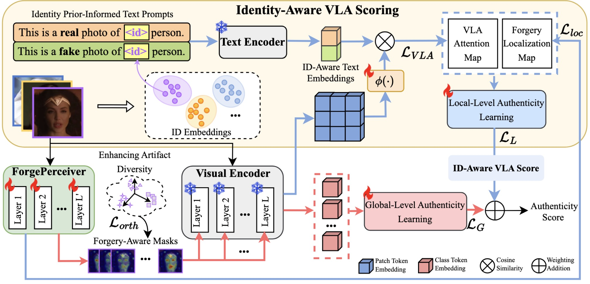

# VLAForge (CVPR 2026)
Official PyTorch implementation of "Unleashing Vision-Language Semantics for Deepfake Video Detection".

## Overview
Recent Deepfake Video Detection (DFD) studies have demonstrated that pre-trained Vision-Language Models (VLMs) such as CLIP exhibit strong generalization capabilities in detecting artifacts across different identities. However, existing approaches focus on leveraging visual features only, overlooking their most distinctive strength — the rich vision-language semantics embedded in the latent space. We propose VLAForge, a novel DFD framework that unleashes the potential of such cross-modal semantics to enhance model's discriminability in deepfake detection.
This work i) enhances the visual perception of VLM through a `ForgePerceiver`, which acts as an independent learner to capture diverse, subtle forgery cues both granularly and holistically, while preserving the pretrained Vision–Language Alignment (VLA) knowledge, and ii) provides a complementary discriminative cue — `Identity-Aware VLA score`, derived by coupling cross-modal semantics with the forgery cues learned by ForgePerceiver. Notably, the VLA score is augmented by an identity prior-informed text prompting to capture authenticity cues tailored to each identity, thereby enabling more discriminative cross-modal semantics. Comprehensive experiments on video DFD benchmarks, including classical face-swapping forgeries and recent full-face generation forgeries, demonstrate that our VLAForge substantially outperforms state-of-the-art methods at both frame and video levels.

## Setup

## Device
- Single NVIDIA GeForce RTX 3090

## Prepare Your Data
#### Step 1. Download the Deepfake Detection Datasets
